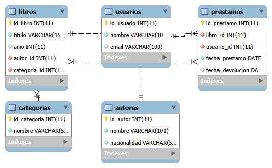

# Proyecto Final - Sistema de Gestión de Biblioteca

Sistema CRUD de gestión de biblioteca con MySQL y backend en NestJS. Proyecto final del curso de Bases de Datos Avanzadas.

## Descripción

Proyecto desarrollado con NestJS (backend) y MySQL (base de datos), que incluye operaciones CRUD y consultas con relaciones entre tablas: `autores`, `categorias`, `libros`, `usuarios` y `prestamos`.

## 1. Base de Datos

- Motor: MySQL
- Tablas: `autores`, `categorias`, `libros`, `usuarios`, `prestamos`
- Diagrama del modelo: `sql/ER-BIBLIOTECA.png`
- Script de creación e inserción: `sql/biblioteca_db.sql`



## 2. Backend

### Librerías empleadas

| Librería | Para qué se usa |
|---|---|
| `@nestjs/typeorm`, `typeorm`, `mysql2` | Conectar el backend a MySQL y mapear las tablas a entidades de TypeScript |
| `@nestjs/config` | Leer variables de entorno (`.env`) para no exponer credenciales en el código |
| `class-validator`, `class-transformer` | Validar los datos que llegan en las peticiones (DTOs) antes de guardarlos en la base de datos |

### Instalación

```bash
npm install
npm install @nestjs/typeorm typeorm mysql2
npm install @nestjs/config
npm install --save class-validator class-transformer
```

### Configuración

Crear un archivo `.env` en la raíz del proyecto con:

```
DB_HOST=localhost
DB_PORT=3306
DB_USERNAME=root
DB_PASSWORD=tu_contraseña
DB_DATABASE=biblioteca
```

### Ejecución

```bash
# desarrollo
npm run start:dev

# producción
npm run start:prod
```

El servidor corre por defecto en `http://localhost:3000`.

### Estructura del proyecto

```
src/
  controllers/   → rutas HTTP por tabla
  dto/           → validación de datos de entrada
  modules/       → conecta entidad + controller + service
  schemas/       → entidades de TypeORM (representan las tablas)
  services/      → lógica que se comunica con la base de datos
```

### Endpoints disponibles

| Método | Ruta | Descripción |
|---|---|---|
| GET | `/autores` | Listar autores |
| DELETE | `/autores/:id` | Eliminar autor |
| POST | `/categorias` | Crear categoría |
| PUT | `/categorias/:id` | Actualizar categoría |
| POST | `/libros` | Crear libro |
| GET | `/libros/:id` | Obtener libro por id |
| GET | `/libros/reportes/detalle` | Consulta con relaciones: libros con autor y categoría |
| PUT | `/usuarios/:id` | Actualizar usuario |
| DELETE | `/usuarios/:id` | Eliminar usuario |
| GET | `/prestamos` | Listar préstamos |
| POST | `/prestamos` | Crear préstamo |
| GET | `/prestamos/activos` | Consulta con relaciones: préstamos sin devolver |

## 3. Pruebas de API (Postman)

- Colección exportada: `postman/Biblioteca_API.json`
- Capturas de las solicitudes: carpeta `postman/capturas/`

## Equipo

Equipo: Rebeca De La Cruz Hernández, Yael Aketzali Cervantes Castillo, Diana Laura Macias Gomez (Ingeniería en Tecnologías de la Información e Innovación Digital, UPA)